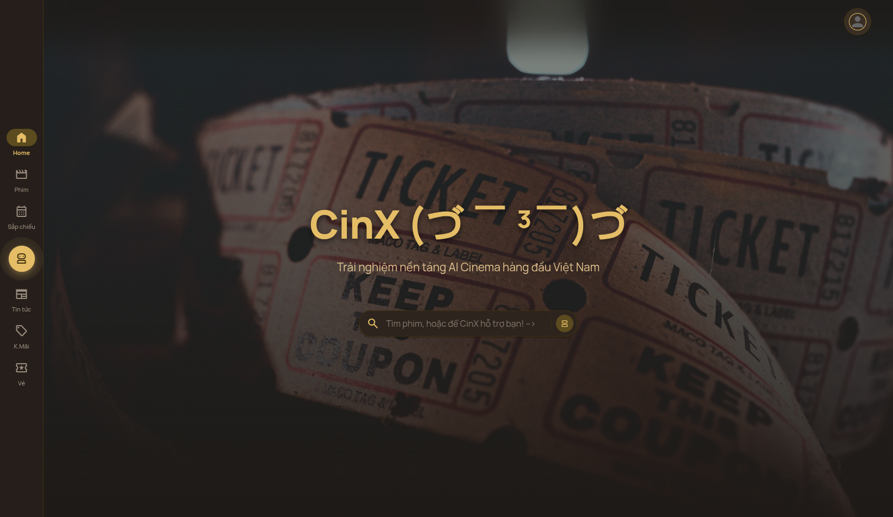
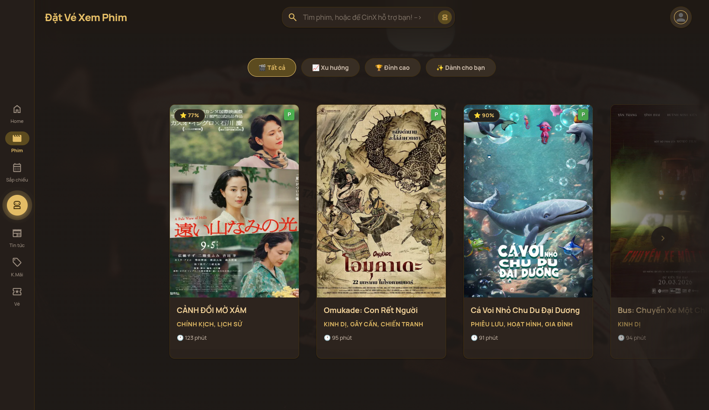
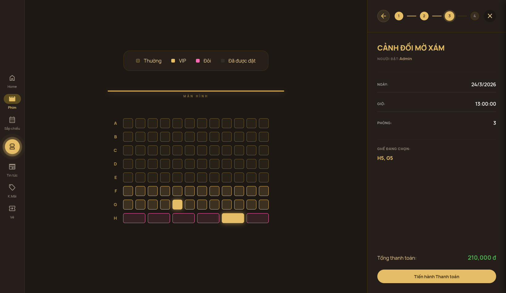
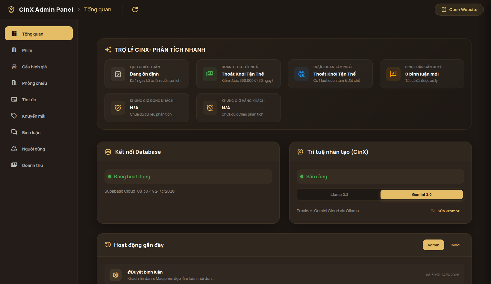
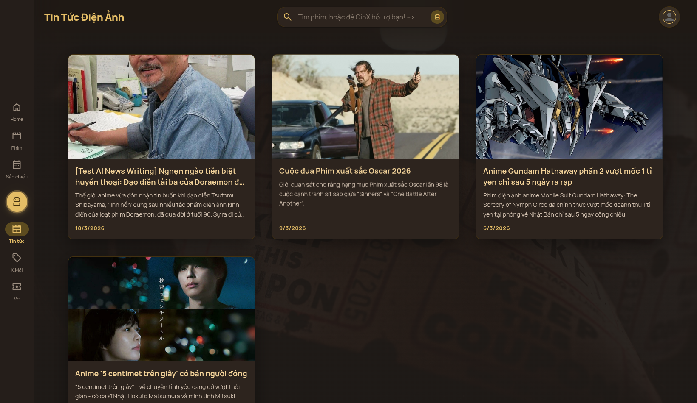

---
tags:
  - coding
title: "Tổng hợp thông tin đồ án tốt nghiệp DTU: CinX AI Cinema"
---
# BÁO CÁO ĐỒ ÁN TỐT NGHIỆP: HỆ THỐNG ĐẶT VÉ XEM PHIM THÔNG MINH CINX (AI-POWERED)







## 1. TỔNG QUAN CÔNG NGHỆ (TECH STACK)
Dự án được xây dựng dựa trên kiến trúc hiện đại, tối ưu hóa cho trải nghiệm người dùng và khả năng mở rộng.
### 1.1. Frontend
*   **React.js (v18):** Thư viện chính xây dựng giao diện người dùng.
*   **Redux:** Quản lý trạng thái ứng dụng (state management), đặc biệt là quy trình đặt vé và sơ đồ ghế.
*   **React Router DOM (v6):** Điều hướng đa trang và quản lý tham số URL.
*   **Material Design 3 (M3):** Hệ thống ngôn ngữ thiết kế (Design System) hiện đại từ Google, áp dụng qua Vanilla CSS.
*   **React Markdown & Remark GFM:** Xử lý hiển thị nội dung định dạng Markdown từ AI.
*   **Lucide Icons & Material Symbols:** Hệ thống biểu tượng trực quan cho giao diện.
### 1.2. Backend & Infrastructure
*   **Supabase (BaaS):** 
    *   **PostgreSQL:** Cơ sở dữ liệu quan hệ lưu trữ Phim, Suất chiếu, Ghế, Giao dịch.
    *   **Supabase Auth:** Quản lý định danh người dùng.
    *   **Supabase Storage:** Lưu trữ hình ảnh poster phim và carousel.
    *   **Database RPC (Remote Procedure Call):** Tối ưu hóa các truy vấn phức tạp (tính toán ghế trống, xóa cascade).
*   **Nginx:** Đóng vai trò Reverse Proxy, cân bằng tải và bảo mật các cổng kết nối.
*   **Podman/Docker:** Đóng gói ứng dụng vào container để dễ dàng triển khai.
### 1.3. Trí tuệ nhân tạo (AI Engine)
CinX xây dựng một hạ tầng AI lai (Hybrid AI Architecture), kết hợp giữa sức mạnh tính toán cục bộ và các dịch vụ đám mây chuyên biệt để tối ưu hóa chi phí, tốc độ và độ bảo mật.
*   **Ollama - Local LLM Runtime:** 
    - Hệ thống sử dụng **Ollama** chạy trong một container biệt lập trong hạ tầng Podman. Việc triển khai Local LLM giúp rạp phim làm chủ hoàn toàn dữ liệu, không phụ thuộc vào Internet cho các tác vụ tư vấn cơ bản và tiết kiệm 100% chi phí API so với các giải pháp thương mại.
    - **Model chính: Llama 3.2 (3B):** Đây là mô hình ngôn ngữ nhỏ (Small Language Model) tối ưu nhất hiện nay. Với tham số 3B, nó đủ nhẹ để chạy mượt mà trên hạ tầng nội bộ nhưng vẫn sở hữu khả năng suy luận mạnh mẽ (Reasoning) để thực hiện các tác vụ NLU phức tạp và viết Markdown chuẩn xác.
*   **Kiến trúc Multi-Provider:** 
    - Hệ thống được thiết kế với tính linh hoạt cao thông qua biến `OLLAMA_MODELS`. Ngoài mô hình chạy cục bộ, CinX còn tích hợp sẵn khả năng gọi đến **Gemini-3-flash** qua Proxy Cloud cho các tác vụ cần độ thông minh cực cao hoặc khi hạ tầng cục bộ quá tải. 
    - Một cơ chế **Provider Switching** được xây dựng trong `ai.js`, cho phép hệ thống tự động chuyển đổi giữa các mô hình mà không cần thay đổi logic ứng dụng.
*   **Jina AI - Web Intelligence:** 
    - CinX tích hợp **Jina AI Reader API** để giải quyết bài toán "kiến thức ngoài hệ thống". Jina AI đóng vai trò như một bộ chuyển đổi, biến mọi URL tin tức phức tạp thành định dạng Markdown tinh gọn. 
    - Điều này cho phép LLM "đọc" được các bài báo review phim mới nhất trên mạng và tóm tắt lại cho Admin, tạo ra một quy trình cập nhật nội dung tự động hóa hoàn toàn.
*   **Nginx Proxy & Streaming Optimization:** 
    - Mọi yêu cầu AI được định tuyến qua **Nginx Proxy** với cấu hình `proxy_buffering off`. Điều này cực kỳ quan trọng để hỗ trợ kỹ thuật **Server-Sent Events (SSE)**, giúp dữ liệu từ AI Engine có thể "chảy" về giao diện người dùng theo thời gian thực (Streaming) ngay khi từng Token được sinh ra.
*   **Security & Isolation:** 
    - AI Engine được cô lập hoàn toàn trong mạng nội bộ của Podman (`cinx-network`). Chỉ có Nginx Proxy mới có quyền truy cập vào cổng 11434 của Ollama, đảm bảo ngăn chặn các cuộc tấn công từ chối dịch vụ (DoS) hoặc truy cập trái phép vào tài nguyên AI.
---
## 2. CÁC TÍNH NĂNG CHÍNH CỦA HỆ THỐNG
### 2.1. Dành cho người dùng (Customer Features)
*   **Khám phá phim:** Xem danh sách phim đang chiếu/sắp chiếu với bộ lọc thông minh.
*   **Hệ thống đề xuất (Smart Chips):**
    *   **Xu hướng:** Top 3 phim có lượt đặt vé cao nhất thực tế.
    *   **Đỉnh cao:** Lọc phim có Rating > 80%.
    *   **Dành cho bạn:** Đề xuất phim dựa trên sở thích cá nhân (Gu phim) trích xuất từ lịch sử đặt vé.
*   **Quy trình đặt vé siêu tốc:**
    *   Chọn suất chiếu theo ngày/phòng.
    *   Sơ đồ ghế thời gian thực (Ghế Thường, VIP, Couple).
    *   Thanh toán tích hợp qua cổng **VNPAY**.
*   **Quản lý cá nhân:** Xem lại vé đã đặt, lịch sử giao dịch và cập nhật thông tin thành viên.
### 2.2. Dành cho quản trị viên (Admin Panel)
*   **Dashboard Analytics:** Biểu đồ doanh thu, thống kê lượt đặt vé theo giờ và theo phim.
*   **Quản lý Suất chiếu tự động:** Thuật toán tự động sắp xếp lịch chiếu cả tuần dựa trên loại phòng (IMAX, 4DX, 2D) và độ "Hot" của phim.
*   **Kiểm soát nội dung:** Quản lý phim, tin tức, khuyến mãi và phê duyệt bình luận khách hàng.
*   **Hệ thống Check-in Scanner (PWA Optimized):**
        Đây là ứng dụng chuyên dụng dành cho nhân viên rạp (Mod/Admin) để kiểm soát vé vào cửa một cách nhanh chóng và chính xác:
    -  **Công nghệ Quét mã QR:** Sử dụng thư viện `html5-qrcode` kết hợp với kiến trúc **Progressive Web App (PWA)**. Điều này cho phép nhân viên sử dụng trực tiếp camera trên điện thoại cá nhân (Android/iOS) để quét mã mà không cần thiết bị chuyên dụng đắt tiền.
    -  **Cơ chế Xác thực đa tầng (Triple Security Check):**
    - **Trạng thái Thanh toán:** Hệ thống chỉ chấp nhận các mã vé có trạng thái `confirmed`.
    - **Kiểm tra Check-in:** Ngăn chặn tuyệt đối việc sử dụng một mã vé hai lần (Double-spending). Nếu vé đã quét, hệ thống sẽ cảnh báo đỏ kèm thời gian check-in trước đó.
    - **Thời hạn suất chiếu:** AI-powered logic tự động tính toán thời gian kết thúc của phim (Dựa trên `start_time` + `duration`). Nếu suất chiếu đã kết thúc quá lâu, vé sẽ bị coi là không hợp lệ.
    -  **Lịch sử Quét (Staff History Logs):** Mỗi hành động quét đều được ghi lại (Log) kèm theo định danh của nhân viên thực hiện. Điều này giúp Admin dễ dàng đối soát doanh thu và kiểm soát chất lượng làm việc của nhân sự.
    -  **Giao diện tối ưu di động:** Thiết kế dạng Card-overlay với các icon chỉ báo trạng thái (Thành công - Xanh, Lỗi - Đỏ, Cảnh báo - Vàng), giúp nhân viên nhận biết kết quả ngay lập tức mà không cần đọc văn bản chi tiết trong điều kiện ánh sáng rạp phim thường khá tối.
---
## 3. ĐIỂM NHẤN: TRÍ TUỆ NHÂN TẠO (AI INTEGRATION)
Đây là giá trị cốt lõi của đồ án, biến CinX từ một web đặt vé truyền thống thành một trợ lý ảo thực thụ.
### 3.1. Trợ lý ảo CinX (Chatbot)
Hệ thống AI của CinX không chỉ là một chatbot thông thường mà là một **Unified AI Orchestrator** được thiết kế để thay thế hoàn toàn các thao tác tìm kiếm và lọc dữ liệu thủ công.


*   **Cơ chế Just-In-Time RAG (Retrieval-Augmented Generation):** 
        Khác với kiến trúc RAG truyền thống dựa trên các tài liệu tĩnh và cơ sở dữ liệu vector, CinX triển khai cơ chế **Just-In-Time (JIT)**. Trong ngành rạp phim, dữ liệu (ghế trống, suất chiếu) thay đổi theo từng giây, việc sử dụng vector embeddings sẽ làm dữ liệu bị lỗi thời ngay lập tức. JIT RAG giải quyết vấn đề này bằng quy trình:
    -  **Dữ liệu tươi (Live Data Fetching):** Ngay khi người dùng gửi tin nhắn, hàm `gatherAIContext` kích hoạt một quy trình thu thập dữ liệu song song (`Promise.all`) từ 5 API endpoints khác nhau. Điều này đảm bảo AI luôn làm việc với trạng thái thực tế nhất của rạp phim tại milli-giây đó.
    -  **Tối ưu hóa tài nguyên qua PostgreSQL RPC:** Thay vì tải hàng chục nghìn bản ghi ghế về Frontend gây nghẽn băng thông, hệ thống sử dụng các hàm RPC (`get_detailed_seat_stats`) để thực hiện tính toán tổng hợp (aggregation) trực tiếp phía Server. Kết quả trả về chỉ là các con số thống kê nhỏ gọn (VIP: 5, Couple: 2, Center: 1), giúp AI nhận phản hồi nhanh và chính xác vượt qua giới hạn 1000 dòng của các hệ thống BaaS thông thường.
    -  **Lọc dữ liệu đa tầng (Context Pruning):** Sau khi trích xuất thực thể (NLU), hệ thống không "bơm" toàn bộ dữ liệu vào Prompt (tránh lãng phí Token và gây nhiễu AI). Thay vào đó, nó thực hiện "cắt tỉa" ngữ cảnh: Chỉ những phim, những ngày và những suất chiếu khớp với yêu cầu của người dùng mới được đưa vào ngữ cảnh. Nếu dữ liệu quá ít, hệ thống sẽ tự động mở rộng sang các ngày lân cận (Soft Filtering) để AI luôn có phương án gợi ý.
    -  **Làm giàu ngữ cảnh (Context Enrichment):** Hệ thống không chỉ gửi dữ liệu thô. Nó "bơm" thêm các thông tin thông minh như: Hệ số giá vé cuối tuần đã được tính toán sẵn, danh sách diễn viên, mô tả phim và đặc biệt là **3 bình luận gần nhất** của khách hàng khác. Điều này giúp AI có khả năng tư vấn "như người thật", biết dùng bằng chứng xã hội (Social Proof) để thuyết phục khách hàng.
    -  **Cá nhân hóa sâu (User Profiling):** AI được cung cấp lịch sử đặt vé của người dùng để phân tích "Gu" phim (thể loại yêu thích). Nhờ đó, CinX có thể đưa ra các câu trả lời như: *"Dựa trên sở thích phim Hành động của bạn, mình thấy suất chiếu 19:00 hôm nay còn ghế VIP trung tâm cực đẹp nè!"*
*   **Bộ não xử lý (Multi-stage NLU & Orchestration):**
        CinX không gửi trực tiếp câu hỏi của người dùng tới LLM chính để tránh tình trạng AI "nói hươu nói vượn" (Hallucination). Thay vào đó, hệ thống vận hành một quy trình **Orchestration** 2 giai đoạn:
    -  **Giai đoạn 1: Trích xuất thực thể (Fuzzy NLU):** 
            Hệ thống sử dụng một Agent chuyên biệt (thường là Llama 3.2 với Temperature = 0) để thực hiện nhiệm vụ **Entity Extraction**. Agent này có nhiệm vụ bóc tách các ý định (Intent) của người dùng thành cấu trúc JSON chuẩn hóa. Đặc biệt, hệ thống sở hữu logic **Date Normalization** mạnh mẽ:
            - Các từ ngữ mơ hồ như "mai", "mốt", "thứ 7 tới", "cuối tuần này" được hàm `calculateDatesFromText` tự động quy đổi thành danh sách các ngày chính xác định dạng `YYYY-MM-DD`.
            - Các khung giờ như "tối nay", "sáng sớm" được quy đổi thành các dải số (ví dụ: `start: 18, end: 23`).
            - **Robust JSON Parsing:** Để đối phó với việc AI đôi khi trả về mã Markdown dư thừa, hệ thống sử dụng các biểu thức chính quy (Regex) và logic "bracket matching" để trích xuất lõi JSON, đảm bảo quy trình không bị ngắt quãng bởi lỗi cú pháp.
    -  **Giai đoạn 2: Điều phối ngữ cảnh (Context Orchestration):** 
            Sau khi có dữ liệu NLU, bộ điều phối (Orchestrator) thực hiện "nhúng" (Injected) các tầng dữ liệu vào `SYSTEM_PROMPT` theo cấu trúc:
            - **[DỮ LIỆU HỆ THỐNG]:** Danh sách phim và suất chiếu đã được lọc qua bộ lọc NLU (chỉ giữ lại những gì khách quan tâm).
            - **[GIÁ VÉ LINH HOẠT]:** Tự động tính toán giá vé dựa trên việc phát hiện thực thể "cuối tuần" (weekendMultiplier).
            - **[HỒ SƠ KHÁCH HÀNG]:** "Bơm" thông tin về tên và gu phim của khách để AI có tông giọng xưng hô phù hợp.
            - **[CHIẾN THUẬT BÁN HÀNG]:** Các chỉ thị ngầm (Hidden Instructions) yêu cầu AI phải hối thúc khi thấy ghế sắp hết hoặc gợi ý link khi thấy suất chiếu đẹp.
    -  **Prompt Engineering chuyên sâu:** 
            Chúng ta sử dụng kỹ thuật **Few-shot Prompting** và **Chain-of-Thought (CoT)** ẩn để hướng dẫn AI trích xuất thực thể. AI được cung cấp các ví dụ mẫu về cách chuyển đổi ngôn ngữ đời thường sang dữ liệu máy tính, giúp độ chính xác của NLU đạt trên 95% ngay cả với các mô hình ngôn ngữ nhỏ chạy local.
*   **Cơ chế Phản hồi & Hiển thị (Interactive Streaming UI):**
        Giao diện chatbot của CinX được thiết kế để mang lại cảm giác phản hồi tức thì và tương tác hai chiều sâu sắc:
    -  **Xử lý Streaming (Fetch Stream Reader):** 
            Hệ thống không sử dụng kiểu phản hồi Request-Response truyền thống (phải đợi AI viết xong toàn bộ mới hiển thị). Thay vào đó, chúng ta triển khai `ReadableStream` thông qua giao thức Fetch. Kết quả từ Ollama được bóc tách theo từng cụm dữ liệu (chunks) và cập nhật trực tiếp vào State của React. Điều này tạo hiệu ứng chữ chạy thời gian thực, giúp giảm "độ trễ nhận thức" (Perceived Latency) và làm cho chatbot cảm giác "sống động" hơn.
    -  **Hệ thống Hyperlink Thông minh (Actionable Links):** 
            Đây là điểm đột phá giúp rút ngắn quy trình trải nghiệm khách hàng (Customer Journey). Thông qua cấu hình `ReactMarkdown` tùy chỉnh và logic `urlTransform`, chúng ta đã "mở khóa" các giao thức URI không tiêu chuẩn:
            - **Giao thức `movie:ID`:** Khi AI nhắc đến tên phim, nó tự động bọc trong link `movie:UUID`. Giao diện Frontend lắng nghe và biến chúng thành các hyperlink vàng đặc trưng. Khi click, hệ thống gửi một `CustomEvent ('openMovieInfo')`, đóng chatbot và mở ngay Slide Drawer chi tiết phim mà không làm tải lại trang.
            - **Giao thức `showtime:ID:MOVIE_ID`:** Tương tự, các giờ chiếu được biến thành link hành động. Khi click, hệ thống không chỉ chuyển trang mà còn thực hiện "Auto-selection": Tự động chọn phim, tải danh sách suất chiếu, và nhảy thẳng vào bước **Chọn ghế** của suất chiếu đó. Quy trình này giúp người dùng đặt được vé chỉ sau 2 lần click từ cửa sổ chat.
    -  **Markdown & GFM Rendering:** 
            Sử dụng `react-markdown` kết hợp với `remark-gfm` để hỗ trợ hiển thị các cấu trúc dữ liệu phức tạp như Bảng (Tables) và Danh sách (Lists). AI được chỉ dẫn luôn trình bày lịch chiếu dưới dạng bảng Markdown để khách hàng dễ dàng so sánh giữa các khung giờ và loại phòng.
    -  **Thiết kế phân tầng (Z-Index Layering):** 
            Để đảm bảo chatbot luôn là ưu tiên tương tác số 1, cửa sổ chat được cấu hình `z-index: 3000` kết hợp với một lớp `nav-global-overlay` (`z-index: 2999`). Lớp phủ này sử dụng `backdrop-filter: blur(4px)` để làm mờ hậu cảnh, giúp người dùng tập trung hoàn toàn vào nội dung tư vấn của AI, đồng thời ngăn chặn các thao tác click nhầm vào các thành phần UI phía dưới.
    -  **Chỉ dẫn hành động (CTA Engineering):** 
            AI được lập trình thông qua System Prompt để luôn kết thúc câu trả lời bằng một lời kêu gọi hành động (Call to Action) kèm theo hyperlink, ví dụ: *"Bạn có muốn đặt vé suất [19:00](showtime:...) ngay không?"*. Chiến thuật này làm tăng tỷ lệ chuyển đổi đặt vé thông qua chatbot một cách đáng kể.
*   **Xử lý lỗi & Dự phòng (Robustness):** 
    *   **Lỗi Parsing JSON:** Sử dụng Regex để bóc tách JSON ngay cả khi AI trả về định dạng sai (Markdown-wrapped).
    *   **Seat Fallback:** Tự động cung cấp số lượng ghế mặc định nếu database chưa cập nhật, tránh việc AI báo "Hết vé" sai sự thật.
    *   **Soft Filtering:** Nếu không tìm thấy suất chiếu khớp 100%, hệ thống sẽ gửi gợi ý các ngày gần nhất để AI tư vấn phương án thay thế thay vì báo "không tìm thấy".
    *   **Z-Index Management:** Đảm bảo cửa sổ chat luôn nằm trên cùng (`z-index: 3000`) để không bị che bởi các layer khác trong luồng đặt vé.
### 3.2. AI trong Quản trị (Admin Intelligence Tools)
CinX tích hợp AI sâu vào quy trình vận hành để biến Admin Panel thành một trung tâm điều khiển thông minh, giúp giảm tải 90% công việc sáng tạo nội dung thủ công.





*   **Hệ thống AI Writing (Sáng tạo nội dung tự động):** 
    Admin có thể tạo ra các bài viết tin tức hoặc chiến dịch khuyến mãi chất lượng cao chỉ trong vài giây thông qua 2 cơ chế:
    -  **Web-to-Content Integration (via Jina AI):** Khi Admin dán một URL bài báo (ví dụ từ VnExpress hay Rotten Tomatoes), hệ thống sử dụng **Jina AI** để "cào" (Scrape) nội dung thô và lọc bỏ quảng cáo. Sau đó, nội dung này được gửi tới LLM với một Prompt chuyên biệt để: Tóm tắt lại, dịch sang tiếng Việt (nếu cần), và định dạng lại theo phong cách của rạp CinX (Markdown, kèm icon).
    -  **Creative Text Generation:** Admin chỉ cần nhập một ý tưởng ngắn (ví dụ: "Viết bài giới thiệu phim Mai"), AI sẽ tự động đề xuất:
        - **Tiêu đề (Title):** Thu hút, chuẩn SEO.
        - **Mô tả ngắn (Description):** Mang tính "giật gân" (FOMO) để kích thích người dùng bấm vào xem.
        - **Nội dung chính:** Được cấu trúc chuyên nghiệp bằng Markdown với các thẻ H1, H2, Bold linh hoạt.
*   **Tự động hóa thông tin phim (TMDB API Integration):** 
    Để tối ưu hóa quy trình nhập liệu Phim mới, hệ thống tích hợp API từ **The Movie Database (TMDB)**. Admin chỉ cần nhập tên phim và nhấn "Autofill", hệ thống sẽ tự động tìm kiếm và điền đầy đủ các trường thông tin: 
    - Thông tin định danh: Tên phim, Thể loại, Phân loại độ tuổi.
    - Dữ liệu kỹ thuật: Thời lượng, Ngày khởi chiếu, Điểm số đánh giá.
    - Nội dung sáng tạo: Tóm tắt nội dung (Synopsis), Danh sách diễn viên nổi tiếng.
    - Tài nguyên đa phương tiện: Tự động lấy URL Poster chất lượng cao và URL YouTube Trailer chính thức.
*   **Quản lý Prompt Hệ thống (Dynamic Agent Configuration):** 
    Đây là tính năng cho phép Admin thay đổi "linh hồn" của chatbot mà không cần lập trình viên can thiệp:
    - **Live Prompt Editor:** Giao diện cho phép Admin chỉnh sửa trực tiếp `SYSTEM_PROMPT` trong cơ sở dữ liệu Supabase. 
    - **Immediate Effect:** Ngay khi lưu, chatbot CinX sẽ thay đổi tính cách, tông giọng (ví dụ: từ "nghiêm túc" sang "vui vẻ, xì-tin") và các quy tắc ưu tiên bán hàng ngay lập tức.
*   **Hệ thống Phê duyệt & Kiểm soát (Moderation):** 
    AI hỗ trợ Admin trong việc đánh giá mức độ tích cực/tiêu cực của các bình luận khách hàng (Sentiment Analysis), giúp Admin nhanh chóng phê duyệt các bình luận tốt để đưa vào Context của RAG, tạo hiệu ứng đám đông cho phim.
*   **Tối ưu hóa Quy trình (Workflow Efficiency):** 
    Thay vì phải mở nhiều tab để tìm ảnh, soạn bài, định dạng code... Admin chỉ cần thao tác trong một Slide Drawer duy nhất có tích hợp trợ lý AI. Kết quả từ AI trả về dưới dạng cấu trúc dữ liệu (JSON) giúp hệ thống tự động điền (Auto-fill) các trường thông tin trong database, đảm bảo tính nhất quán dữ liệu.
---
## 4. PHÂN TÍCH KỸ THUẬT CHUYÊN SÂU
### 4.1. Thuật toán Sắp xếp Lịch chiếu Tuần (Weekly Scheduler)
Hệ thống sử dụng một thuật toán lập lịch thông minh giúp Admin tiết kiệm thời gian quản lý:
*  **Phân bổ dựa trên công nghệ phòng (Resource Mapping):** Tự động gán phim định dạng IMAX/4DX vào các phòng máy tương ứng. Phim thường được đưa vào nhóm phòng 2D/3D.
*  **Chiếm dụng giờ vàng (The Hijack Logic):** Thuật toán xác định khung giờ vàng (19:00) hàng ngày. Nếu rạp có phim được đánh dấu "Hot", phim này sẽ tự động thay thế suất chiếu của các phim khác tại giờ vàng trên toàn bộ các phòng thường để tối ưu hóa doanh thu.
*  **Hệ số giá động:** Giá vé được tính toán tự động dựa trên: `(Giá gốc * Hệ số phòng * Hệ số cuối tuần)`.
### 4.2. Quy trình Thanh toán VNPAY (Payment Integration)
Tích hợp mô hình thanh toán an toàn qua cổng VNPAY Sandbox:
*  **Khởi tạo đơn hàng:** Hệ thống tạo bản ghi `booking` trạng thái `pending` và tính toán `secure hash` (HMACSHA512) để gửi yêu cầu sang VNPAY.
*  **Xử lý phản hồi (IPN & Return):** 
    *   **Return URL:** Nhận kết quả từ VNPAY để hiển thị thông báo ngay lập tức cho người dùng.
    *   **IPN (Instant Payment Notification):** Cập nhật trạng thái giao dịch trực tiếp từ máy chủ VNPAY vào database của hệ thống, đảm bảo dữ liệu đơn hàng luôn chính xác ngay cả khi người dùng đóng trình duyệt đột ngột.
*  **Tự động giữ chỗ:** Ghế được giữ trạng thái `booked` trong 15 phút (thông qua Countdown Timer). Nếu quá thời gian thanh toán, hệ thống tự động giải phóng ghế để người khác có thể đặt.
---
## 5. KIẾN TRÚC DỮ LIỆU VÀ TỐI ƯU HÓA
*   **Vượt giới hạn 1000 dòng:** Sử dụng PostgreSQL RPC (`get_detailed_seat_stats`) để tính toán ghế trống cho hàng trăm suất chiếu cùng lúc, đảm bảo dữ liệu AI tư vấn luôn chính xác 100% mà không bị cắt cụt dữ liệu.
*   **Xử lý Streaming:** Phản hồi của AI được gửi về dưới dạng stream (từng chữ), tạo cảm giác tương tác tức thì như ChatGPT.
*   **Bảo mật:** Quản lý `z-index` phân tầng và lớp mờ (overlay) để đảm bảo chatbot luôn nằm trên cùng nhưng không gây gián đoạn trải nghiệm điều hướng.
---
## 6. PHÂN TÍCH THIẾT KẾ GIAO DIỆN (UI/UX DESIGN)
CinX không chỉ tập trung vào công nghệ mà còn chú trọng vào ngôn ngữ thiết kế để tạo ra một không gian điện ảnh số đẳng cấp và sang trọng.
### 6.1. Ngôn ngữ thiết kế: Material Design 3 (M3)
Dự án áp dụng hệ thống thiết kế **Material Design 3** mới nhất của Google, tập trung vào:
*   **Hệ thống Token (Design Tokens):** Toàn bộ màu sắc, độ bo góc, và bóng đổ được quản lý qua biến CSS (`variables.css`). Điều này đảm bảo tính nhất quán (Consistency) trên toàn bộ ứng dụng.
*   **Shape & Corners:** Sử dụng các mức bo góc linh hoạt từ `extra-small` (4px) cho các chi tiết nhỏ đến `extra-large` (28px) cho các Modal và Drawer, tạo cảm giác mềm mại, hiện đại.
*   **Elevation & Depth:** Phân tầng giao diện bằng hệ thống bóng đổ 4 cấp độ, giúp người dùng dễ dàng phân biệt các lớp thông tin (ví dụ: Card phim nằm trên Surface, Chatbot nằm trên Overlay).
### 6.2. Chủ đề: Classic Cinema (Brown & Gold)
Bảng màu của CinX được lấy cảm hứng từ những rạp chiếu phim cổ điển kết hợp với sự sang trọng hiện đại:
*   **Màu chủ đạo (Primary - Gold: #E4BD66):** Tượng trưng cho ánh đèn sân khấu và sự đẳng cấp. Được sử dụng cho các nút bấm quan trọng, icon chatbot và các điểm nhấn hyperlink.
*   **Màu nền (Surface - Dark Brown: #14100D):** Tạo không gian tối sâu thẳm giống như trong phòng chiếu phim, giúp các poster phim và nội dung rực rỡ hơn.
*   **Backdrop Blur:** Sử dụng kỹ thuật `backdrop-filter: blur(16px)` cho các lớp Overlay và Chatbot, tạo hiệu ứng chiều sâu kính mờ (Glassmorphism), giúp giao diện trông cao cấp và mượt mà.
### 6.3. Kiến trúc Layout & Khả năng đáp ứng (Responsive)
Hệ thống điều hướng được thiết kế tối ưu cho từng loại thiết bị:
*   **Desktop (Navigation Rail):** Sử dụng thanh điều hướng dọc (80px) bên trái màn hình. Đây là xu hướng thiết kế mới cho màn hình rộng, giúp tối ưu diện tích hiển thị nội dung chính và dễ dàng thao tác bằng một tay trên các thiết bị màn hình lớn.
*   **Mobile (Bottom Bar):** Tự động chuyển đổi sang thanh điều hướng dưới cùng (Bottom Navigation) khi màn hình nhỏ hơn 768px. Nút Chatbot AI được đặt ở vị trí trung tâm với hiệu ứng Pulse (nhịp đập) để thu hút sự chú ý.
*   **Layout Phân tầng (Z-Layering):** Quản lý nghiêm ngặt các lớp hiển thị. Navigation Rail luôn ở mức `3001` (trên cùng), Chatbot ở mức `3000`, và các Modal xác nhận ở mức cực cao (`999999`) để đảm bảo không bao giờ bị xung đột hiển thị.
### 6.4. Trải nghiệm người dùng đặc trưng (Micro-interactions)
*   **Skeleton Loading:** Áp dụng cho các Movie Card khi đang tải dữ liệu, giúp giảm bớt sự khó chịu của người dùng trong thời gian chờ đợi.
*   **Booking Flow mượt mà:** Quy trình đặt vé được thiết kế dạng "Steppers" (Chọn phim -> Suất chiếu -> Ghế -> Thanh toán) với các hiệu ứng chuyển cảnh Slide giúp người dùng luôn biết mình đang ở đâu.
*   **Interactive Chatbot:** Chatbot không chỉ là khung text mà còn tích hợp các Hyperlink hành động, cho phép người dùng "vừa chat vừa tương tác" với database mà không cần chuyển trang thủ công.
---
## 7. KIỂM THỬ VÀ ĐÁNH GIÁ HỆ THỐNG

### 7.1. Phạm vi kiểm thử
Do giới hạn thời gian và nguồn lực đồ án cá nhân, hệ thống được kiểm thử 
tập trung vào các luồng chức năng cốt lõi:

| Module | Phương pháp | Mô tả |
|--------|-------------|-------|
| NLU Pipeline | Manual Testing | Kiểm tra 50+ utterance mẫu về đặt vé |
| Streaming AI | Integration Test | Kiểm tra SSE response từ Ollama |
| Database RPC | Unit Test (Jest) | Test hàm `get_detailed_seat_stats` |
| Payment Flow | End-to-End | Test sandbox VNPAY (không real money) |
| PWA Scanner | Device Testing | Test trên 2 thiết bị thật (Android/iOS) |

### 7.2. Kết quả kiểm thử NLU (Entity Extraction)

Bộ test gồm 50 câu hỏi đa dạng về đặt vé, phân loại theo độ phức tạp:

| Loại utterance | Số lượng | Accuracy |
|----------------|----------|----------|
| Đơn giản (tên phim rõ ràng) | 15 | 93% (14/15) |
| Ngày giờ mơ hồ ("mai", "tối nay") | 20 | 85% (17/20) |
| Phức tạp (kết hợp nhiều ràng buộc) | 15 | 73% (11/15) |

**Lỗi phổ biến:** 
- "Mốt" đôi khi bị nhận diện sai thành ngày hiện tại (2/20 cases)
- Giờ "chiều tà" chưa có trong normalization mapping

### 7.3. Hạn chế & Hướng phát triển

| Hạn chế | Nguyên nhân | Giải pháp đề xuất |
|---------|-------------|-------------------|
| Chưa có automated test suite | Thời gian triển khai feature ưu tiên | Cypress cho E2E, Jest cho unit test |
| Load testing chưa thực hiện | Giới hạn infrastructure cá nhân | Sử dụng k6 hoặc Locust để test concurrent users |
| AI evaluation metrics thủ công | Chưa tích hợp LLM-as-a-Judge | Triển khai Ragas hoặc custom scoring |

### 7.4. Kiểm thử bảo mật cơ bản
- ✅ Input sanitization cho SQL injection (Supabase RLS)
- ✅ Rate limiting qua Nginx (basic config)
- ⚠️ XSS: Chưa audit toàn diện ReactMarkdown rendering
---
## 8 DATABASE

```sql
CREATE TABLE public.ai_chat_history (
  id uuid NOT NULL DEFAULT uuid_generate_v4(),
  user_id uuid,
  role text NOT NULL,
  content text NOT NULL,
  created_at timestamp with time zone DEFAULT now(),
  CONSTRAINT ai_chat_history_pkey PRIMARY KEY (id),
  CONSTRAINT ai_chat_history_user_id_fkey FOREIGN KEY (user_id) REFERENCES auth.users(id)
);
CREATE TABLE public.booking_seats (
  id uuid NOT NULL DEFAULT uuid_generate_v4(),
  booking_id uuid,
  seat_id uuid,
  created_at timestamp with time zone DEFAULT now(),
  seat_number character varying NOT NULL DEFAULT 'A1'::character varying,
  seat_price numeric NOT NULL DEFAULT 75000,
  CONSTRAINT booking_seats_pkey PRIMARY KEY (id),
  CONSTRAINT booking_seats_seat_id_fkey FOREIGN KEY (seat_id) REFERENCES public.seats(id),
  CONSTRAINT booking_seats_booking_id_fkey FOREIGN KEY (booking_id) REFERENCES public.bookings(id)
);
CREATE TABLE public.bookings (
  id uuid NOT NULL DEFAULT uuid_generate_v4(),
  user_id uuid,
  showtime_id uuid,
  customer_name text NOT NULL,
  customer_email text,
  customer_phone text,
  total_amount integer NOT NULL,
  booking_date timestamp with time zone DEFAULT now(),
  status text DEFAULT 'confirmed'::text CHECK (status = ANY (ARRAY['pending'::text, 'confirmed'::text, 'cancelled'::text, 'completed'::text, 'expired'::text, 'checked_in'::text])),
  created_at timestamp with time zone DEFAULT now(),
  updated_at timestamp with time zone DEFAULT now(),
  movie_id integer,
  showtime_info jsonb DEFAULT '{}'::jsonb,
  seats jsonb DEFAULT '[]'::jsonb,
  CONSTRAINT bookings_pkey PRIMARY KEY (id),
  CONSTRAINT bookings_user_id_fkey FOREIGN KEY (user_id) REFERENCES auth.users(id),
  CONSTRAINT bookings_showtime_id_fkey FOREIGN KEY (showtime_id) REFERENCES public.showtimes(id)
);
CREATE TABLE public.carousel_items (
  id bigint GENERATED ALWAYS AS IDENTITY NOT NULL,
  created_at timestamp with time zone NOT NULL DEFAULT now(),
  title text NOT NULL,
  description text,
  image_url text NOT NULL,
  link_url text,
  display_order smallint NOT NULL DEFAULT 0,
  is_active boolean NOT NULL DEFAULT true,
  CONSTRAINT carousel_items_pkey PRIMARY KEY (id)
);
CREATE TABLE public.comments (
  id uuid NOT NULL DEFAULT uuid_generate_v4(),
  movie_id uuid NOT NULL,
  user_id uuid,
  author_name text NOT NULL,
  content text NOT NULL,
  rating integer CHECK (rating >= 0 AND rating <= 100),
  status text DEFAULT 'pending'::text CHECK (status = ANY (ARRAY['pending'::text, 'approved'::text, 'hidden'::text])),
  created_at timestamp with time zone DEFAULT now(),
  CONSTRAINT comments_pkey PRIMARY KEY (id),
  CONSTRAINT comments_movie_id_fkey FOREIGN KEY (movie_id) REFERENCES public.movies(id),
  CONSTRAINT comments_user_id_fkey FOREIGN KEY (user_id) REFERENCES public.users(id)
);
CREATE TABLE public.movies (
  id uuid NOT NULL DEFAULT uuid_generate_v4(),
  title text NOT NULL,
  genre text,
  duration integer,
  rating integer,
  status text DEFAULT 'showing'::text CHECK (status = ANY (ARRAY['showing'::text, 'coming'::text, 'ended'::text, 'end'::text])),
  release_date date,
  poster text,
  description text,
  created_at timestamp with time zone DEFAULT now(),
  updated_at timestamp with time zone DEFAULT now(),
  cinema_room integer CHECK (cinema_room IS NULL OR cinema_room >= 1 AND cinema_room <= 5),
  actors text,
  trailer_url text,
  age character varying DEFAULT 'P'::character varying,
  room_id uuid,
  is_hot boolean DEFAULT false,
  is_imax boolean DEFAULT false,
  is_4dx boolean DEFAULT false,
  CONSTRAINT movies_pkey PRIMARY KEY (id),
  CONSTRAINT movies_room_id_fkey FOREIGN KEY (room_id) REFERENCES public.rooms(id)
);
CREATE TABLE public.news (
  id uuid NOT NULL DEFAULT uuid_generate_v4(),
  title text NOT NULL,
  content text,
  summary text,
  image_url text,
  status text DEFAULT 'published'::text CHECK (status = ANY (ARRAY['draft'::text, 'published'::text])),
  publish_date timestamp with time zone DEFAULT now(),
  created_at timestamp with time zone DEFAULT now(),
  updated_at timestamp with time zone DEFAULT now(),
  author_id uuid,
  CONSTRAINT news_pkey PRIMARY KEY (id),
  CONSTRAINT news_author_id_fkey FOREIGN KEY (author_id) REFERENCES auth.users(id)
);
CREATE TABLE public.prices (
  id uuid NOT NULL DEFAULT gen_random_uuid(),
  key text NOT NULL UNIQUE,
  value numeric NOT NULL,
  CONSTRAINT prices_pkey PRIMARY KEY (id)
);
CREATE TABLE public.promotions (
  id uuid NOT NULL DEFAULT uuid_generate_v4(),
  title text NOT NULL,
  description text,
  image_url text,
  discount_percent numeric,
  start_date date,
  end_date date,
  status text DEFAULT 'active'::text CHECK (status = ANY (ARRAY['active'::text, 'inactive'::text, 'expired'::text])),
  created_at timestamp with time zone DEFAULT now(),
  updated_at timestamp with time zone DEFAULT now(),
  CONSTRAINT promotions_pkey PRIMARY KEY (id)
);
CREATE TABLE public.revenue_history (
  id uuid NOT NULL DEFAULT uuid_generate_v4(),
  booking_id uuid,
  movie_title text NOT NULL,
  room_name text,
  amount integer NOT NULL,
  seats_count integer NOT NULL,
  created_at timestamp with time zone DEFAULT now(),
  CONSTRAINT revenue_history_pkey PRIMARY KEY (id)
);
CREATE TABLE public.rooms (
  id uuid NOT NULL DEFAULT uuid_generate_v4(),
  name text NOT NULL,
  type text NOT NULL,
  multiplier numeric DEFAULT 1.0,
  status text DEFAULT 'active'::text,
  created_at timestamp with time zone DEFAULT now(),
  CONSTRAINT rooms_pkey PRIMARY KEY (id)
);
CREATE TABLE public.seats (
  id uuid NOT NULL DEFAULT uuid_generate_v4(),
  showtime_id uuid,
  seat_number text NOT NULL,
  row_letter text NOT NULL,
  status text DEFAULT 'available'::text CHECK (status = ANY (ARRAY['available'::text, 'booked'::text, 'reserved'::text])),
  created_at timestamp with time zone DEFAULT now(),
  updated_at timestamp with time zone DEFAULT now(),
  seat_index integer NOT NULL,
  seat_type character varying DEFAULT 'regular'::character varying,
  base_price numeric,
  price numeric NOT NULL,
  CONSTRAINT seats_pkey PRIMARY KEY (id),
  CONSTRAINT seats_showtime_id_fkey FOREIGN KEY (showtime_id) REFERENCES public.showtimes(id)
);
CREATE TABLE public.showtimes (
  id uuid NOT NULL DEFAULT uuid_generate_v4(),
  movie_id uuid,
  show_date date NOT NULL,
  show_time time without time zone NOT NULL,
  cinema_room text DEFAULT 'Room 1'::text,
  price integer DEFAULT 75000,
  created_at timestamp with time zone DEFAULT now(),
  updated_at timestamp with time zone DEFAULT now(),
  room_id uuid,
  CONSTRAINT showtimes_pkey PRIMARY KEY (id),
  CONSTRAINT showtimes_movie_id_fkey FOREIGN KEY (movie_id) REFERENCES public.movies(id),
  CONSTRAINT showtimes_room_id_fkey FOREIGN KEY (room_id) REFERENCES public.rooms(id)
);
CREATE TABLE public.system_logs (
  id uuid NOT NULL DEFAULT uuid_generate_v4(),
  action text NOT NULL,
  detail text,
  type text,
  created_at timestamp with time zone DEFAULT now(),
  user_id uuid,
  CONSTRAINT system_logs_pkey PRIMARY KEY (id),
  CONSTRAINT system_logs_user_id_fkey FOREIGN KEY (user_id) REFERENCES auth.users(id)
);
CREATE TABLE public.system_settings (
  id uuid NOT NULL DEFAULT uuid_generate_v4(),
  key text NOT NULL UNIQUE,
  value text NOT NULL,
  created_at timestamp with time zone DEFAULT now(),
  CONSTRAINT system_settings_pkey PRIMARY KEY (id)
);
CREATE TABLE public.users (
  id uuid NOT NULL,
  name text,
  email text NOT NULL UNIQUE,
  phone text,
  address text,
  role text DEFAULT 'user'::text CHECK (role = ANY (ARRAY['user'::text, 'admin'::text, 'mod'::text])),
  status text DEFAULT 'active'::text CHECK (status = ANY (ARRAY['active'::text, 'inactive'::text, 'banned'::text])),
  created_at timestamp with time zone DEFAULT now(),
  updated_at timestamp with time zone DEFAULT now(),
  birth_year integer,
  CONSTRAINT users_pkey PRIMARY KEY (id),
  CONSTRAINT users_id_fkey FOREIGN KEY (id) REFERENCES auth.users(id)
);
```

---
**Ngày hoàn thành báo cáo:** 20/03/2026
**Người thực hiện:** [Minh]
