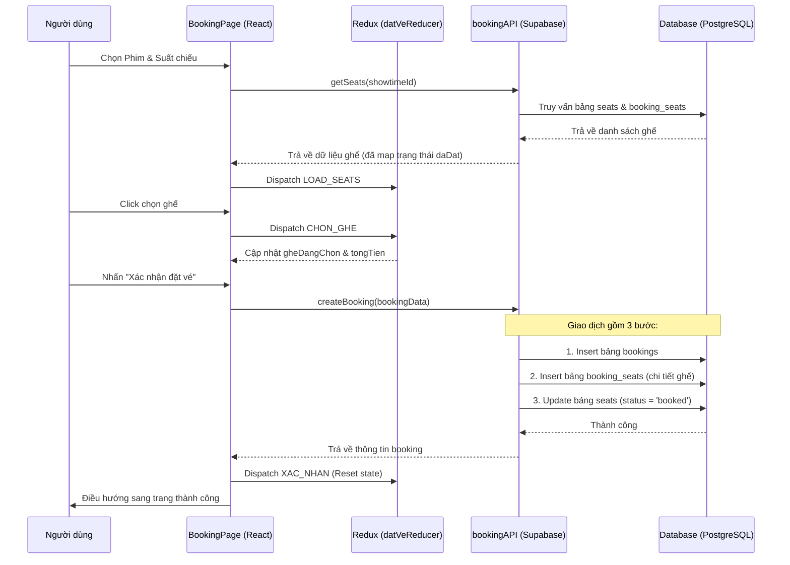
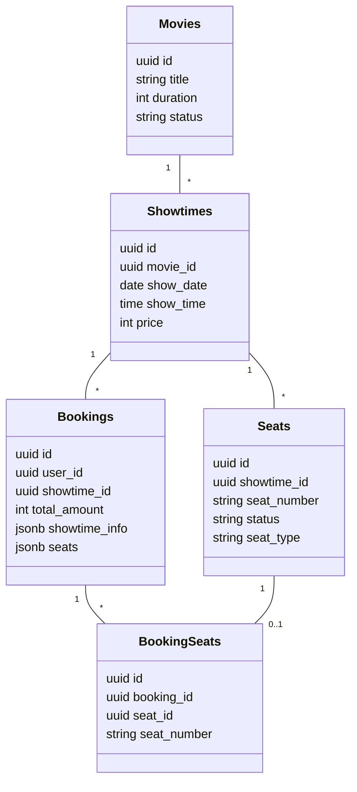

---
tags:
  - coding
title: CinemaHub - Booking logic
---
# Tài liệu Phân tích Logic Đặt vé - CinemaHub

Tài liệu này phân tích quy trình đặt vé từ lúc chọn ghế đến khi hoàn tất giao dịch trong hệ thống CinemaHub.

## 1. Tổng quan Luồng nghiệp vụ (Workflow)

## 2. Mô hình Dữ liệu (Data Model)

Hệ thống sử dụng mô hình quan hệ trên Supabase với các bảng chính:

## 3. Các thành phần Logic chi tiết

### A. Quản lý trạng thái (Redux State)
Nằm tại `src/redux/reducers/datVeReducer.js`, quản lý:
- `danhSachGhe`: Cấu trúc phân theo hàng (A, B, C...) để hiển thị UI.
- `gheDangChon`: Danh sách ghế người dùng đang click.
- `tongTien`: Tính toán realtime dựa trên giá của từng loại ghế (Regular, VIP, Couple).

### B. Logic xử lý Ghế (bookingAPI.getSeats)
Đây là phần phức tạp nhất vì phải xử lý dữ liệu lai:
1. **Ghế thực:** Nếu `showtimeId` tồn tại trong DB, API sẽ lấy dữ liệu từ bảng `seats`.
2. **Ghế Mock:** Nếu không có dữ liệu ghế, hệ thống tự sinh 96 ghế (8 hàng x 12 ghế) để đảm bảo UI không bị trống.
3. **Kiểm tra trạng thái:** API thực hiện join (hoặc filter) với bảng `booking_seats` để xác định ghế nào đã được đặt cho suất chiếu cụ thể đó.

### C. Quy trình tạo Booking (bookingAPI.createBooking)
Hệ thống thực hiện lưu trữ đa tầng:
- **Tầng quan hệ:** Lưu vào `bookings` và `booking_seats` để báo cáo và quản lý.
- **Tầng JSON:** Lưu toàn bộ thông tin suất chiếu và danh sách ghế vào cột JSONB của bảng `bookings`. Điều này giúp bảo toàn dữ liệu lịch sử ngay cả khi suất chiếu hoặc ghế đó bị xóa/thay đổi sau này.
- **Cập nhật trạng thái:** Chỉ cập nhật `status = 'booked'` cho các ghế thuộc đúng `showtime_id` hiện tại để tránh ảnh hưởng đến các suất chiếu khác cùng phòng.

## 4. Các lưu ý về tính bảo mật và toàn vẹn
- **Xác thực:** Yêu cầu `user_id` từ `AuthContext`. Nếu chưa đăng nhập, hệ thống sẽ chặn đặt vé.
- **Ràng buộc phòng chiếu:** Admin logic giới hạn tối đa 5 phim "đang chiếu" tương ứng với 5 phòng máy có sẵn.
- **Xử lý lỗi UUID:** API có logic fallback để xử lý trường hợp ID người dùng hoặc ID suất chiếu không đúng định dạng UUID (thường gặp khi dùng dữ liệu mock).
