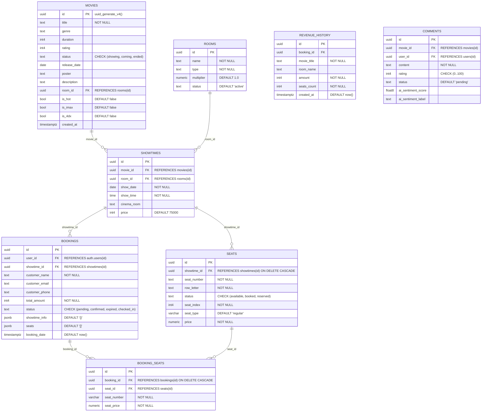

# LƯỢC ĐỒ CƠ SỞ DỮ LIỆU VẬT LÝ (PHYSICAL DATABASE SCHEMA)

Tài liệu này mô tả cấu trúc chi tiết các bảng, kiểu dữ liệu và các ràng buộc trong cơ sở dữ liệu PostgreSQL (Supabase) của hệ thống CinX.

## 1. Lược đồ vật lý (Mermaid Diagram)

## 2. Đặc tả các kiểu dữ liệu đặc biệt

- **`uuid`**: Sử dụng cho khóa chính để đảm bảo tính duy nhất trên toàn cầu, đặc biệt hữu ích cho việc đồng bộ dữ liệu với Supabase Auth.
- **`jsonb`**: Lưu trữ dữ liệu dạng JSON đã được tối ưu hóa (Binary JSON). Trường `showtime_info` sử dụng kiểu này để lưu snapshot thông tin phim, suất chiếu và danh sách ghế tại thời điểm giao dịch, giúp truy vấn lịch sử nhanh mà không cần Join.
- **`timestamptz`**: Lưu trữ thời gian kèm theo thông tin múi giờ (Timezone), đảm bảo tính chính xác khi hiển thị giờ chiếu cho người dùng ở các vùng khác nhau.

## 3. Các ràng buộc và logic Cascade

- **`ON DELETE CASCADE` (Bảng SEATS & BOOKING_SEATS)**: 
    - Khi một `SHOWTIME` bị xóa, toàn bộ 90 ghế tương ứng trong bảng `SEATS` sẽ tự động bị xóa theo.
    - Khi một `BOOKING` bị xóa, các dòng chi tiết ghế trong `BOOKING_SEATS` cũng sẽ bị xóa tự động để tránh rác dữ liệu.
- **`CHECK Constraints`**: 
    - Đảm bảo trạng thái đơn hàng (`status`) chỉ được nhận các giá trị hợp lệ.
    - Đảm bảo điểm đánh giá phim (`rating`) luôn nằm trong khoảng 0-100.
