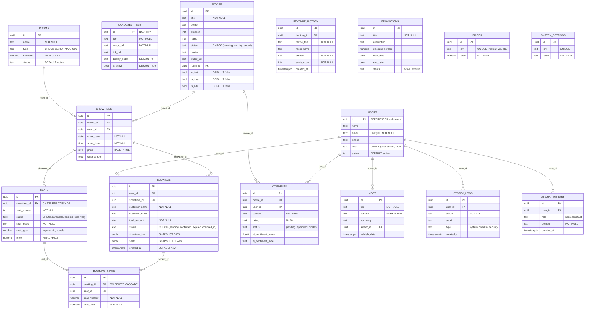

# LƯỢC ĐỒ CƠ SỞ DỮ LIỆU HOÀN CHỈNH (COMPLETE DATABASE SCHEMA) - CINX PROJECT

Tài liệu này trình bày chi tiết 15 bảng dữ liệu vận hành toàn bộ hệ thống đặt vé, quản trị và trí tuệ nhân tạo của CinX.

## 1. Biểu đồ Lược đồ vật lý (Physical Schema Diagram)

## 2. Danh mục 15 bảng và Chức năng

1.  **`movies`**: Lưu trữ thông tin phim, poster và metadata phục vụ hiển thị và lọc AI.
2.  **`rooms`**: Định nghĩa hạ tầng phòng chiếu và hệ số nhân giá vé.
3.  **`showtimes`**: Lịch chiếu cụ thể kết hợp giữa Phim, Phòng và Thời gian.
4.  **`seats`**: Quản lý trạng thái 90 ghế ngồi riêng biệt cho từng suất chiếu.
5.  **`bookings`**: Thông tin đơn hàng tổng quát và trạng thái thanh toán.
6.  **`booking_seats`**: Chi tiết các ghế cụ thể khách đã đặt trong một đơn hàng.
7.  **`users`**: Hồ sơ người dùng mở rộng và phân quyền (Admin/Mod/User).
8.  **`comments`**: Bình luận người dùng kèm kết quả phân tích cảm xúc của AI.
9.  **`news`**: Các bài viết tin tức điện ảnh (hỗ trợ bởi AI Editor).
10. **`promotions`**: Thông tin các chương khuyễn mãi và mã giảm giá.
11. **`revenue_history`**: Dữ liệu doanh thu đã được tối ưu hóa cho báo cáo và biểu đồ.
12. **`system_logs`**: Nhật ký hoạt động quản trị để phục vụ hậu kiểm.
13. **`prices`**: Cấu hình giá vé gốc và các hệ số cuối tuần của hệ thống.
14. **`system_settings`**: Lưu trữ cấu hình kỹ thuật (AI Provider, System Prompt).
15. **`carousel_items`**: Quản lý các banner trình chiếu tại đầu trang chủ.

---
**Lưu ý kỹ thuật**: Lược đồ này sử dụng mô hình **Hybrid Schema** (Kết hợp quan hệ truyền thống và JSONB cho dữ liệu snapshot) giúp hệ thống đạt hiệu năng truy vấn cao nhất trong môi trường Real-time của Supabase.
