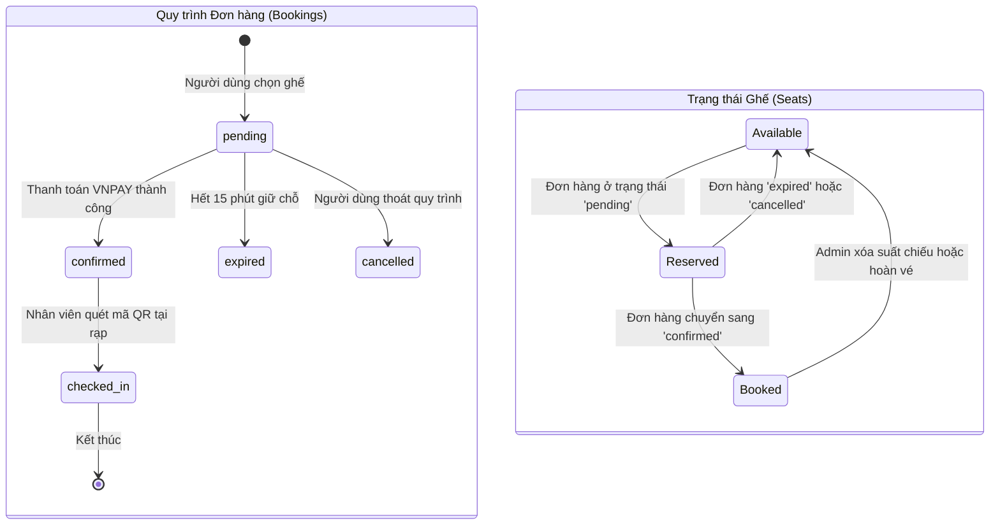

# THIẾT KẾ CƠ SỞ DỮ LIỆU CHI TIẾT - DỰ ÁN CINX

Tài liệu này bao gồm Sơ đồ quan hệ thực thể (ERD), Sơ đồ chuyển trạng thái dữ liệu và Từ điển dữ liệu chi tiết của hệ thống.

---

## 1. Sơ đồ Quan hệ Thực thể (ER Diagram)

```mermaid
erDiagram
    %% CORE BUSINESS ENTITIES
    MOVIES ||--o{ SHOWTIMES : "has"
    ROOMS ||--o{ SHOWTIMES : "hosts"
    SHOWTIMES ||--o{ SEATS : "manages"
    SHOWTIMES ||--o{ BOOKINGS : "includes"
    
    %% TRANSACTIONAL FLOW
    BOOKINGS ||--o{ BOOKING_SEATS : "details"
    SEATS ||--o{ BOOKING_SEATS : "reserved_as"
    BOOKINGS ||--o| REVENUE_HISTORY : "records"

    %% USER ACTIONS & CONTENT
    USERS ||--o{ BOOKINGS : "places"
    USERS ||--o{ COMMENTS : "writes"
    MOVIES ||--o{ COMMENTS : "reviewed_by"
    USERS ||--o{ NEWS : "authors"
    
    %% SYSTEM & INTELLIGENCE
    USERS ||--o{ AI_CHAT_HISTORY : "converses"
    USERS ||--o{ SYSTEM_LOGS : "triggers"

    MOVIES {
        uuid id PK
        text title
        text genre
        int4 duration
        int4 rating
        text status
        date release_date
        text poster
        text description
        uuid room_id FK
        bool is_hot
        bool is_imax
        bool is_4dx
    }

    ROOMS {
        uuid id PK
        text name
        text type
        numeric multiplier
        text status
    }

    SHOWTIMES {
        uuid id PK
        uuid movie_id FK
        uuid room_id FK
        date show_date
        time show_time
        text cinema_room
        int4 price
    }

    SEATS {
        uuid id PK
        uuid showtime_id FK
        text seat_number
        text row_letter
        text status
        int4 seat_index
        varchar seat_type
        numeric price
    }

    BOOKINGS {
        uuid id PK
        uuid user_id FK
        uuid showtime_id FK
        text customer_name
        text customer_email
        int4 total_amount
        text status
        jsonb showtime_info
        jsonb seats
    }

    BOOKING_SEATS {
        uuid id PK
        uuid booking_id FK
        uuid seat_id FK
        varchar seat_number
        numeric seat_price
    }

    USERS {
        uuid id PK
        text name
        text email UK
        text phone
        text role
        text status
    }

    COMMENTS {
        uuid id PK
        uuid movie_id FK
        uuid user_id FK
        text author_name
        text content
        int4 rating
        text status
        float8 ai_sentiment_score
        text ai_sentiment_label
    }

    REVENUE_HISTORY {
        uuid id PK
        uuid booking_id FK
        text movie_title
        text room_name
        int4 amount
        int4 seats_count
    }
```



---

## 2. Sơ đồ Chuyển trạng thái (State Transition Diagram)

Biểu đồ này mô tả vòng đời của một Đơn hàng và cách nó tác động đến trạng thái Ghế ngồi trong hệ thống CinX.



---

## 3. Từ điển Dữ liệu (Data Dictionary)

Dưới đây là chi tiết các bảng quan trọng nhất trong hệ thống.

### 3.1. Bảng `movies` (Thông tin Phim)
| Tên cột | Kiểu dữ liệu | Ràng buộc | Mô tả |
|---------|--------------|-----------|-------|
| `id` | UUID | PK, Default: v4 | Mã định danh duy nhất của phim. |
| `title` | Text | Not Null | Tiêu đề phim. |
| `status` | Text | Check: showing, coming, ended | Trạng thái hiển thị của phim. |
| `is_hot` | Boolean | Default: false | Phim nổi bật (ưu tiên xếp lịch giờ vàng). |
| `duration` | Integer | Nullable | Thời lượng phim (phút). |

### 3.2. Bảng `bookings` (Đơn hàng)
| Tên cột | Kiểu dữ liệu | Ràng buộc | Mô tả |
|---------|--------------|-----------|-------|
| `id` | UUID | PK | Mã đơn hàng (dùng để tạo mã QR). |
| `user_id` | UUID | FK (auth.users) | Liên kết tới người đặt vé. |
| `status` | Text | Default: pending | pending, confirmed, expired, checked_in. |
| `total_amount`| Integer | Not Null | Tổng tiền thanh toán. |
| `showtime_info`| JSONB | Nullable | Snapshot thông tin suất chiếu tại thời điểm mua. |

### 3.3. Bảng `seats` (Ghế ngồi thực tế)
| Tên cột | Kiểu dữ liệu | Ràng buộc | Mô tả |
|---------|--------------|-----------|-------|
| `id` | UUID | PK | Mã định danh vị trí ghế. |
| `showtime_id` | UUID | FK (showtimes) | Thuộc suất chiếu cụ thể nào. |
| `status` | Text | available, booked | Tình trạng ghế (trống hay đã bán). |
| `seat_type` | Varchar | regular, vip, couple | Phân loại loại ghế. |
| `is_center` | Boolean | Nullable | Xác định ghế trung tâm (AI ưu tiên gợi ý). |

### 3.4. Bảng `comments` (Bình luận & AI Sentiment)
| Tên cột | Kiểu dữ liệu | Ràng buộc | Mô tả |
|---------|--------------|-----------|-------|
| `id` | UUID | PK | Mã bình luận. |
| `ai_sentiment_score` | Float8 | Nullable | Điểm cảm xúc (0 đến 1) do AI chấm. |
| `ai_sentiment_label` | Text | Nullable | Nhãn: Positive, Negative, Neutral. |
| `status` | Text | pending, approved, hidden | Trạng thái kiểm duyệt. |

---

## 4. Cấu trúc trường dữ liệu JSONB (`showtime_info`)

Hệ thống sử dụng JSONB để lưu trữ bản sao dữ liệu tại thời điểm giao dịch để đảm bảo tính toàn vẹn lịch sử:
```json
{
  "date": "2026-04-29",
  "time": "19:00",
  "movie_title": "Deadpool & Wolverine",
  "cinema_room": "IMAX Room 1",
  "seats": [
    {"soGhe": "H10", "price": 120000},
    {"soGhe": "H11", "price": 120000}
  ]
}
```
